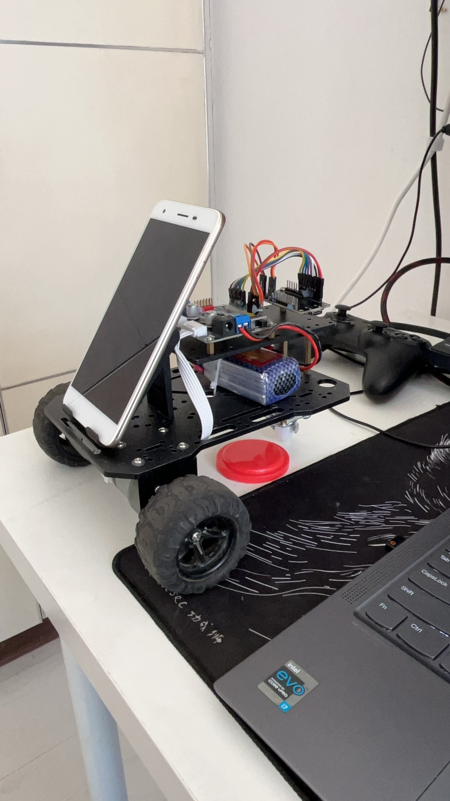

# CruiseCar

[English](README.md) | [简体中文](README.zh-CN.md)

Smart cruise car project with two subprojects:

- `android-app`: Android 6.0+ Kotlin app. It can run as a sender controller or a receiver mounted on the car.
- `esp32-firmware`: ESP-IDF firmware. ESP32 exposes a Classic Bluetooth SPP service, parses controller packets, and drives the TB6612 motor controller with encoder feedback.

## Hardware Requirements

| Device / Module | Qty | Purpose |
| --- | ---: | --- |
| ESP32 development board | 1 | Main controller. Receives control packets forwarded by the Android receiver and outputs motor/servo control signals. |
| TB6612 dual-channel motor driver | 1 | Drives the left and right DC geared motors with direction control and PWM speed control. |
| 520 geared DC motor | 2 | Left/right drive motors. Encoder versions can be connected to E1/E2 feedback inputs. |
| Double-layer / perforated car chassis | 1 | Mounts ESP32, motor driver, battery, phone holder, and other hardware. |
| Wheels | 2 | Connected to the 520 geared motors for movement. |
| Caster / support wheel | 1 | Keeps the chassis balanced. |
| Battery / battery holder | 1 | Powers the motor driver and ESP32. Follow module voltage requirements and share ground where required. |
| Android phone (receiver) | 1 | Mounted on the car for video capture, object detection/following, and forwarding control commands to ESP32 over Bluetooth/TCP paths. |
| Android phone (sender) | 1 | Remote controller that shows joystick/video UI and sends control commands. |
| Phone holder / mounting parts | 1 | Holds the receiver phone at the front of the car as the onboard camera. |
| Dupont wires / ribbon cables / screws / standoffs | Several | Wiring and mechanical mounting. |
| Servo, e.g. SG90 or compatible 180° servo | 1 (optional) | Firmware reserves GPIO18 for 50Hz PWM, usable for camera tilt or other mechanisms. |
| Bluetooth gamepad | 1 (optional) | Can control the car directly through the ESP32 HID Host path while keeping the Android SPP path available. |

## Project Appearance

Current physical build: the receiver Android phone is mounted at the front as the onboard camera; ESP32, motor driver, battery, and wiring modules are fixed on a perforated chassis; two side wheels are driven by 520 geared motors; a support wheel keeps the chassis balanced.



## Current Architecture

```text
Sender Android
  UDP broadcast discovery
  TCP control channel
Receiver Android
  Classic Bluetooth SPP
Bluetooth HID Gamepad
  Classic Bluetooth / BLE HID
ESP32
  SPP packet parser
  HID Host parser
  TB6612 motor control
  E1/E2 encoder feedback
```

Android 6.0 cannot act as a Bluetooth HID gamepad through the official Android API, so the first version uses Classic Bluetooth SPP between the receiver phone and ESP32. The packet model is still gamepad-shaped so ESP32 can later add a Bluetooth HID Host input path for real controllers.

ESP32 now supports both input paths at the same time: the receiver Android app can stay connected over Classic Bluetooth SPP while ESP32 also scans for and connects to a Bluetooth HID gamepad. Both paths are normalized to the same `LX/LY/RX/RY/buttons` gamepad state before reaching the motor controller. The most recent input wins; disconnecting one path only stops the car if no other control path is connected.

## Android Modes

The sender and receiver apps now share a 10-byte TCP control frame model:

- Manual control: sender shows the on-screen gamepad and sends gamepad frames to the receiver. The receiver transparently forwards those frames to ESP32 over SPP.
- Real-time video: sender sends a mode frame, then connects to the receiver WebRTC signaling server on port `42102`. The receiver publishes camera + microphone through WebRTC, and the sender renders the remote media.
- Smart follow: sender sends a mode frame. The receiver starts camera preview + OpenCV color tracking locally and sends generated gamepad frames directly to ESP32, so the sender does not need to keep driving.
- Smart patrol: reserved mode frame and UI entry. The receiver stops motion and logs the selected mode until route planning is added.
- OpenCV object demo: app camera preview feeds frames into a YOLO TFLite detector, detection results are rendered as rectangle overlays on top of the camera view. The detector consumes a `frameProvider` abstraction so the same camera frame path can later be shared with WebRTC sending.

## Directory Layout

```text
.
├── android-app/
│   ├── app/build.gradle
│   └── app/src/main/
│       ├── assets/
│       │   ├── detect.tflite        # YOLO/LiteRT model used by the Android object demo
│       │   └── labels.txt           # detection class labels
│       └── java/com/cruisecar/app/
│           ├── MainActivity.kt
│           └── ObjectRecognitionDemo.kt
├── esp32-firmware/
│   ├── main/
│   └── scripts/
├── esp32-gamepad-hid-demo/
│   ├── main/
│   └── scripts/
└── ml/
    ├── train_server.py          # web-based training platform (Flask + multimodal LLM + YOLO)
    ├── auto_label_orange.py     # helper used to bootstrap labels from the orange can region
    ├── beibingyang.yaml         # template Ultralytics dataset config
    #
    # Canonical subdirs (kept as placeholders via .gitkeep; contents are gitignored):
    ├── weights/                 # base pretrained checkpoints (yolo11n.pt, yolo26n.pt, yolov8s-worldv2.pt, …)
    ├── uploads/                 # raw uploaded videos (one run → one video file)
    ├── extractions/             # raw frame JPGs extracted from a video, one subdir per run_id
    │    └── 20260804_232133/
    │         ├── frame_0001.jpg … frame_NNNN.jpg
    │         ├── train/         # symlinks/copies made by split_dataset
    │         └── val/
    ├── datasets/                # every run produces one dataset folder (split + yaml + labels)
    │    └── 20260804_232133/
    │         ├── dataset.yaml
    │         ├── labels/        # per-frame .txt YOLO labels + train/val split
    │         └── dataset/       # what Ultralytics actually trains on
    │              ├── images/{train,val}/
    │              └── labels/{train,val}/
    ├── outputs/                 # training runs and final .pt exports
    │    ├── 20260804_232133/weights/best.pt
    │    └── beibingyang_can_20260804_232133.pt   # downloadable copy
    └── _tmp/                    # transient scratch pad, gitignored
```

Training environments and run contents are ignored by Git; the canonical folders stay tracked via their `.gitkeep` placeholder so a fresh clone still has the skeleton structure in place:

```text
# Virtual environments + Python caches
ml/**/.venv*/
ml/**/__pycache__/
ml/**/*.cache

# All run-specific contents (the 5 canonical folders are tracked, their payloads are not)
ml/extractions/**
ml/uploads/**
ml/datasets/**
ml/outputs/**
ml/weights/**                # base checkpoints can be re-downloaded
ml/_tmp/**

# Historical root-level training leftovers from earlier iterations
runs/
weights/
yolo*.pt
yolov8s-worldv2.pt
```

TCP ports:

```text
42100 UDP discovery
42101 TCP control frames
42102 TCP WebRTC signaling
```

## Control Packet

Gamepad frame, 10 bytes:

```text
AA 55 01 LX LY RX RY BTN_L BTN_H SUM
```

- `AA 55`: header
- `01`: protocol version
- `LX`, `LY`, `RX`, `RY`: joystick axes, `0..255`, center `128`
- `BTN_L`, `BTN_H`: 16-bit button bitmask, little-endian
- `SUM`: low 8 bits of the sum of the first 9 bytes

Mode frame, 10 bytes:

```text
AA 55 02 MODE 00 00 00 00 00 SUM
```

- `MODE=00`: manual control
- `MODE=01`: real-time video
- `MODE=02`: smart follow
- `MODE=03`: smart patrol

Button bits are aligned with the current ESP32 HID gamepad demo logs:

```text
bit 0: A
bit 1: B
bit 3: X
bit 4: Y
bit 6: L1
bit 7: R1
bit 8: L2
bit 9: R2
```

The Android sender exposes an on-screen gamepad and sends this same packet to the receiver Android app over TCP. The receiver app transparently forwards each packet to `CruiseCar-ESP32` over Classic Bluetooth SPP.

On the receiver app, use `自动扫描并连接 ESP32` to avoid manually entering the Bluetooth address. The app first checks paired Classic Bluetooth devices, then scans for a device named `CruiseCar-ESP32`, and connects over SPP.

## ESP32 Wiring

TB6612 motor driver:

```text
STBY -> GPIO27

Left motor A:
  PWMA -> GPIO13
  AIN1 -> GPIO14
  AIN2 -> GPIO12

Right motor B:
  PWMB -> GPIO33
  BIN1 -> GPIO25
  BIN2 -> GPIO26
```

Encoder inputs:

```text
E1A -> GPIO22 / D22
E1B -> GPIO23 / D23
E2A -> GPIO21 / D21
E2B -> GPIO19 / D19
```

ESP32 GPIO inputs are 3.3 V only. If the encoder board outputs 5 V, use level shifting or power the encoder logic from 3.3 V if supported.

## Build

Android:

```powershell
cd android-app
.\gradlew.bat assembleDebug
```

ESP32:

```powershell
cd esp32-firmware
.\scripts\build-esp32.ps1
```

## YOLO/TFLite Object Detection Training

The current object demo uses a one-class YOLO detector for the `beibingyang_can` label. The first dataset was generated from:

```text
/Users/bytedance/Downloads/飞书20260804-120018.mp4
```

Training data flow:

1. Extract frames from the source video into `ml/extractions/{run_id}/frame_XXXX.jpg`.
2. Send each frame + your textual description (any language) to the local multimodal LLM at `http://127.0.0.1:12345`; the LLM returns normalized bounding boxes directly.
3. Labels are written in YOLO format to `ml/datasets/{run_id}/labels/`; 90% / 10% are split into train and val inside `ml/datasets/{run_id}/dataset/{images,labels}/{train,val}/`.
4. Train YOLO with the generated `ml/datasets/{run_id}/dataset.yaml`; ultralytics logs live under `ml/outputs/{run_id}/`.
5. Copy the best checkpoint to `ml/outputs/{class_name}_{run_id}.pt`, export it to LiteRT/TFLite, and copy it to `android-app/app/src/main/assets/detect.tflite`.

Useful commands from this training run (run from `ml/`):

```bash
# Train from the YOLO11 nano checkpoint (manual fallback, not needed if using the web UI).
.\.venv\Scripts\yolo detect train `
  model=weights/yolo11n.pt `
  data=beibingyang.yaml `
  imgsz=416 `
  epochs=60 `
  batch=4 `
  device=cpu `
  project=outputs `
  name=beibingyang_yolo11n `
  exist_ok=True

# Export the best checkpoint. Ultralytics now maps tflite export to LiteRT.
.\.venv\Scripts\yolo export `
  model=outputs/beibingyang_yolo11n/weights/best.pt `
  format=litert `
  imgsz=416

# Install the exported model into the Android app.
cp outputs/beibingyang_yolo11n/weights/best.tflite `
  ..\android-app\app\src\main\assets\detect.tflite
```

The generated model currently has this tensor contract:

```text
input:  [1, 3, 416, 416] float32 RGB, NCHW, normalized to 0..1
output: [1, 5, 3549] float32 YOLO boxes/classes
```

`ObjectRecognitionDemo.kt` supports both NCHW and NHWC RGB TFLite inputs and parses YOLO output layouts `[1, boxes, attrs]` and `[1, attrs, boxes]`.

The initial training set contains 53 frames from one video, so it is good for validating the pipeline and detecting the same can in similar desk scenes. For robust detection, add more short videos with different distances, rotations, lighting, backgrounds, and partial occlusion, then repeat the same extract-label-train-export cycle.

## Web-Based Training Platform

`ml/train_server.py` is a one-file Flask app that wraps the entire extract-label-train pipeline into a browser UI. Instead of running CLI commands manually, you upload a video, describe the object you want to track (any language, including Chinese like "红色盖子的罐子"), and click one button.

### Prerequisites

The existing `.venv` under `ml/` already has `ultralytics`, `opencv-python`, `torch` (CUDA), and `flask` installed. The app uses `yolo11n.pt` as the base training checkpoint (downloaded on first run if missing).

**Required**: a local multimodal LLM server (e.g. `llama.cpp` server with a VL-capable model such as `qwen3.5-VL`) running at `http://127.0.0.1:12345` and exposing the standard `/v1/chat/completions` API with image input support. The labeling step sends every frame to the LLM together with your textual description, and the LLM returns normalized bounding boxes directly.

### Start the server

```powershell
cd ml
.\.venv\Scripts\python.exe train_server.py
```

Open `http://127.0.0.1:5000` in the browser.

### Usage

1. **Upload video** — drag and drop or click the upload area (MP4, AVI, MOV, MKV, WEBM, etc.).
2. **Enter the target description** — any language works. E.g. `beibingyang_can`, `bottle with red cap`, `橙色带拉环的饮料罐`, `红色盖子的罐子`. The more visual details you give (colors, shape, material), the better the LLM will place boxes.
3. **(Optional) Advanced settings** — adjust frame extraction FPS, train/val split ratio, epochs, image size, batch size, and device.
4. **Click "Start Training"** — the pipeline runs in the background with real-time progress:
   - **Extract frames** — OpenCV extracts keyframes at the configured FPS.
   - **Auto-label (LLM)** — each frame plus your description is sent to the LLM, which returns strict JSON `{"boxes":[[x1,y1,x2,y2],...]}` with 0..1 normalized coordinates. Boxes are converted to YOLO `cx cy bw bh` labels and saved per frame.
   - **Split dataset** — frames are split 90/10 into train/val and a `dataset.yaml` is generated.
   - **Train** — Ultralytics trains a YOLO11n model with the configured parameters.
5. **Download** — when training finishes, click the download button to save the `.pt` model file.

### Pipeline architecture

```text
Browser UI (HTML/CSS/JS)
  │
  ├─ POST /api/upload      → save video to _uploads/
  ├─ POST /api/process     → start background pipeline thread
  ├─ GET  /api/status      → poll progress (step, %, logs)
  ├─ GET  /api/llm_status  → check local LLM availability
  └─ GET  /api/download    → download trained .pt file

Backend (Flask, single file)
  │
  ├─ extract_frames()      → cv2.VideoCapture → JPG frames
  ├─ auto_label_frames()   → per-frame multimodal LLM call
  │    └─ llm_detect_boxes()  → input: image + text description; output: [[x1,y1,x2,y2],...] in [0,1]
  ├─ split_dataset()       → train/val split + dataset.yaml
  └─ YOLO.train()          → ultralytics training API
```

### Output locations

Each run `{run_id}` = timestamp `YYYYmmdd_HHMMSS` scatters artifacts into four canonical folders:

```text
ml/
  uploads/{run_id}.{mp4,webm,...}        → uploaded video
  extractions/{run_id}/                  → raw extracted frames + train/val split symlinks
  datasets/{run_id}/                     → labels/, dataset/{images,labels}/{train,val}/, dataset.yaml
  outputs/
    {run_id}/                            → ultralytics training logs, events, tensorboard
    {run_id}/weights/best.pt             → best checkpoint during training
    {class_name}_{run_id}.pt             → downloadable copy (shown in /api/download as final model)
```

The final downloadable model is saved as `outputs/{class_name}_{run_id}.pt`.
